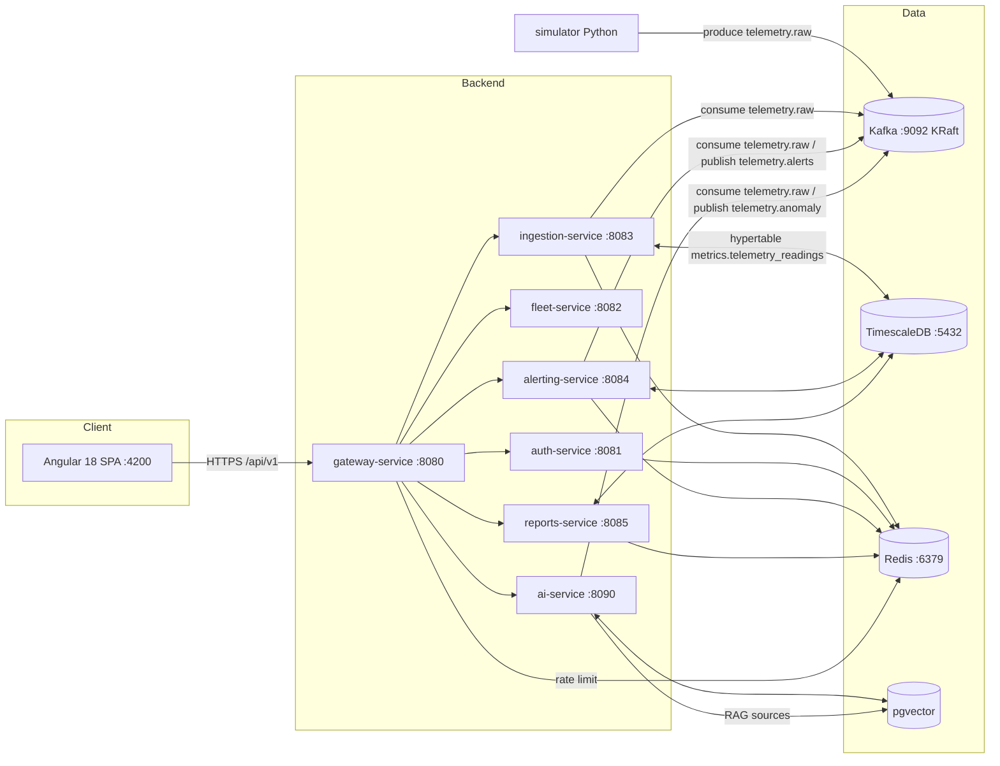
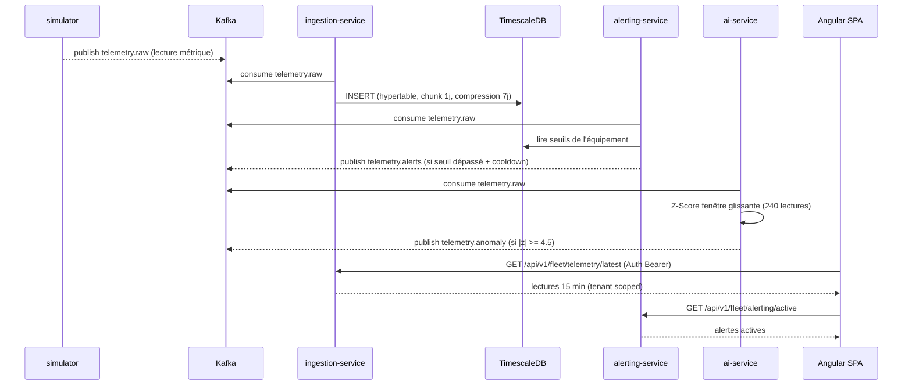

# TelemetryHub — Architecture technique

## 1. Vue d'ensemble

TelemetryHub est une plateforme **SaaS multi-tenant** de supervision d'équipements industriels.
Elle ingère en continu une télémétrie (température, vibration, pression, débit…), la stocke dans
TimescaleDB, déclenche des alertes en temps réel, détecte des anomalies statistiques et expose un
assistant IA nav̈é sur la base de connaissances de l'exploitant (RAG).

> Nuage : 6 microservices Spring Boot + 1 service AI Python (FastAPI), streaming Kafka, frontend SPA.

## 2. Vue des conteneurs

## 3. Séquence d'un flux de données

## 4. Modèle de données (schémas PostgreSQL/TimescaleDB)

| Schéma | Objets | Rôle |
| --- | --- | --- |
| `tenant` | organisations, users | Multi-tenant initiaux |
| `fleet` | equipments, sites, metrics | Parc d'équipements |
| `metrics` | `telemetry_readings` (hypertable) | Lectures métriques (tensio-active) |
| `alerts` | rules, alerts | Règles de seuil + occurrences |
| `reports` | reports, report_history | Rapports planifiés / générés |
| `ai` | `documents`, `chunks`, `embeddings` | Base RAG (pgvector) |

Les lectures métriques sont regroupées en hypertable (`time` + `tenant_id` commit) :
- intervalle de chunk : **1 jour**, rétention 90 jours ;
- compression TimescaleDB activée après **7 jours** (chunks read-only).

## 5. Sécurité et multi-tenancy

- `auth-service` : inscription/organisation, login, refresh token → **JWT HS256** signé.
- `gateway-service` : valide le JWT, injecte `X-Tenant-Id` / `X-User-Id` / `X-User-Role`,
  applique un **rate limiting** Redis global (+ par route JWT) et route `/api/v1/**`.
- Chaque service résout le tenant depuis le header ; l'isolation est forcée dans le
  `TenantContextTenantFilter` et dans toutes les requêtes SQL (filtre `tenant_id`).
- Actuator : seul `/actuator/health`, `/actuator/info`, `/actuator/prometheus` sont exposés publiquement.

## 6. Observabilité

| Brique | Configuration | Exemple de métrique |
| --- | --- | --- |
| Prometheus | `infra/monitoring/prometheus/prometheus.yml` (scrape :8090/actuator/prometheus) | `http_server_requests_seconds` |
| Grafana | datasource + dashboards provisionnés | « TelemetryHub — Vue d'ensemble » |
| Loki + Promtail | auto-découverte des conteneurs Docker | logs `ingestion`, `alerting`… |

## 7. Déploiement

- **Local** : `docker compose up -d --build` (tous les services + Kafka + TSDB + Redis + frontend).
- **Probe Kubernetes** (Helm `infra/k8s/helm/telemetryhub`) : 1 Deployment/Service/Ingress par
  service, readiness/liveness `/actuator/health`, config + secrets via `values.yaml`.
- **Cloud** (Terraform `infra/terraform`) : GKE (2 pools, autoscaler), Cloud SQL
  PostgreSQL 15 + TimescaleDB, Memorystore Redis, VPC nat.

## 8. Références des ports

| Port | Service | Public | Actuator |
| --- | --- | --- | --- |
| 8080 | gateway | ✅ | ✅ |
| 8081 | auth | via GW | ✅ |
| 8082 | fleet | via GW | ✅ |
| 8083 | ingestion | via GW | ✅ |
| 8084 | alerting | via GW | ✅ |
| 8085 | reports | via GW | ✅ |
| 8090 | ai-service | ✅ | ✅ |
| 4200 | frontend | ✅ | — |
| 9092 | Kafka | infra | — |
| 5432 | TimescaleDB | infra | — |
| 6379 | Redis | infra | — |